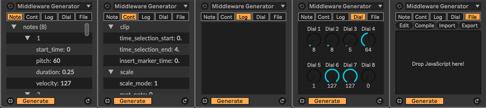

# Middleware

Middleware acts as [middleware](https://en.wikipedia.org/wiki/Middleware) between Ableton Live MIDI generators and transformers and JavaScript, making it easy to generate and transform MIDI in JavaScript.

Middleware provides two devices, both available in Ableton Live's Clip interface: `Middleware Generator` that's available under `Generate` and `Middleware Transformer` that's available under `Transform`.

## Tabs

### Note

Shows the current `"notes"` dictionary, this is what will be output to Live.

### Cont

Shows the current `"context"` dictionary, this is contextual information that can be used in a script.

### Log

Anything output through the first outlet (e.g., `output(0, "Hello World");`) will be logged here. It's cleared each time the script is run.

### Dial

### File

## Default JavaScript

### [Template](javascript/middleware_template.js)

A minimal script that generates a single note that doesn't include any additional scripts.

### [Generator](javascript/middleware_generator.js)

An example MIDI generator.

### [Transformer](javascript/middleware_transformer.js)

An example MIDI transformer.

## Workflow

### Editing

Under the `File` tab, there's an `Edit` button. The `Edit` button will open the JavaScript file in a text editor, closing the window will prompt for a path to save the edited script.

### Running

The script is run by pushing the `Apply` button.

When `Generate` or `Transform` toggle is turned on, turning a dial will also run the script again.
